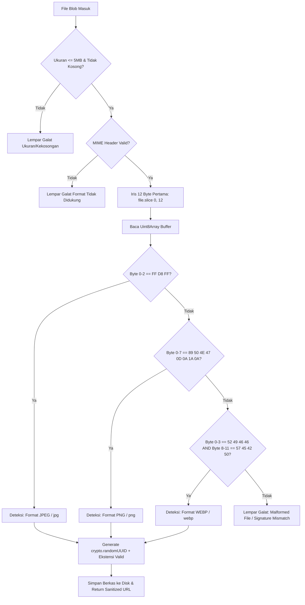
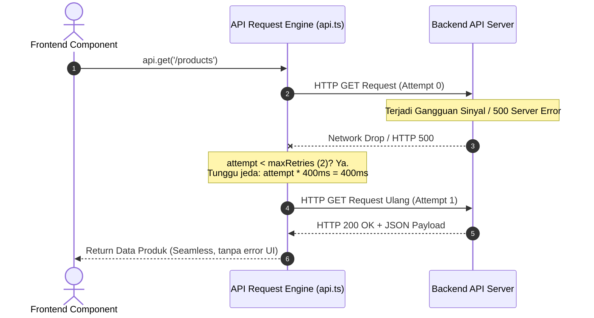
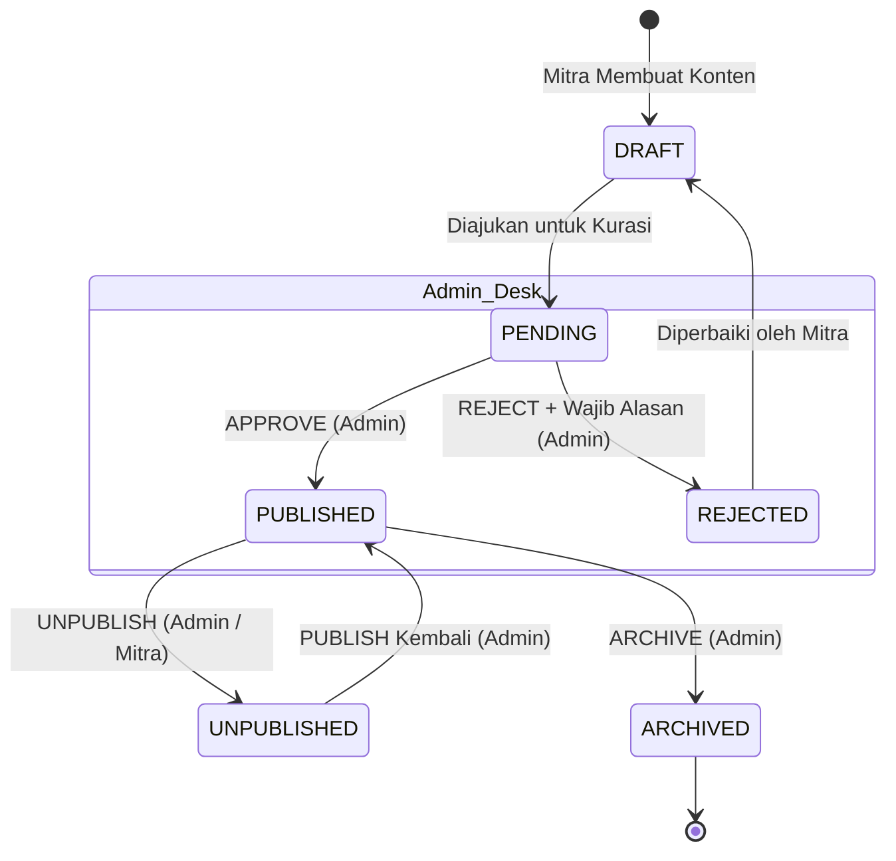

# 🔬 Bedah Algoritma & Implementasi Teknis: Local Warung UMKM

Dokumen ini menyajikan dokumentasi teknis mendalam mengenai metode, algoritma, alur komputasi, dan pola arsitektur perangkat lunak yang diimplementasikan pada platform **Local Warung UMKM**.

---

## 📑 Daftar Isi

1. [Algoritma Validasi Tanda Tangan Berkas (Magic Bytes File Sniffing)](#1-algoritma-validasi-tanda-tangan-berkas-magic-bytes-file-sniffing)
2. [Algoritma Evaluasi Jam Operasional Dinamis (Store Schedule Evaluator)](#2-algoritma-evaluasi-jam-operasional-dinamis-store-schedule-evaluator)
3. [Metode Optimasi Kueri Agregasi (Anti-N+1 In-Memory Hash Mapping)](#3-metode-optimasi-kueri-agregasi-anti-n1-in-memory-hash-mapping)
4. [Algoritma Analitik Konversi & Agregasi CTR (Click-Through Rate Engine)](#4-algoritma-analitik-konversi--agregasi-ctr-click-through-rate-engine)
5. [Algoritma Resiliensi Jaringan: Auto-Retry dengan Backoff Linear](#5-algoritma-resiliensi-jaringan-auto-retry-dengan-backoff-linear)
6. [Strategi Caching Multi-Tier Progressive Web App (Service Worker PWA)](#6-strategi-caching-multi-tier-progressive-web-app-service-worker-pwa)
7. [State Machine Moderasi Berjenjang (Content Lifecycle & Invariant Validation)](#7-state-machine-moderasi-berjenjang-content-lifecycle--invariant-validation)
8. [Pola Sanitasi Data & Data Transfer Object (Stock Privacy Serializer)](#8-pola-sanitasi-data--data-transfer-object-stock-privacy-serializer)

---

## 1. Algoritma Validasi Tanda Tangan Berkas (Magic Bytes File Sniffing)

### Masalah & Latar Belakang Keamanan
Pada aplikasi web yang membolehkan pengguna mengunggah gambar produk, mengandalkan ekstensi nama berkas (misal `.jpg`, `.png`) atau header HTTP `Content-Type` adalah kerentanan keamanan kritis (*MIME-type spoofing*). Penyerang dapat mengunggah skrip berbahaya (misal shell script atau berkas HTML/JS) dengan mengubah ekstensi berkas menjadi `.jpg`.

### Solusi Algoritma
Diimplementasikan pada `LocalStorageProvider.validateFile` di [backend/src/services/storage.ts](file:///c:/Users/user/Desktop/local-warung-umkm/backend/src/services/storage.ts). Sistem membaca buffer byte awal (*magic numbers*) dari berkas biner secara langsung menggunakan operasi irisan memori (*memory slicing*), tanpa perlu memuat keseluruhan berkas ke dalam RAM.



### Karakteristik Tanda Tangan Byte
| Format Gambar | Posisi Offset | Tanda Tangan Biner (Heksadesimal) | Karakter ASCII |
|---|---|---|---|
| **JPEG / JPG** | Byte 0 - 2 | `FF D8 FF` | ÿØÿ |
| **PNG** | Byte 0 - 7 | `89 50 4E 47 0D 0A 1A 0A` | .PNG.... |
| **WEBP** | Byte 0 - 3 & 8 - 11 | `52 49 46 46` ... `57 45 42 50` | `RIFF` ... `WEBP` |

### Sanitasi Anti-Directory Traversal
Untuk mencegah *Directory Traversal Attack* (`../../etc/passwd`) saat operasi penggantian atau penghapusan berkas, nama berkas diisolasi dengan memeriksa:
$$\text{filename}.\text{includes}('..') \lor \text{filename}.\text{includes}('/') \lor \text{filename}.\text{includes}('\\')$$
Jika ditemukan karakter tersebut, operasi langsung dibatalkan secara aman.

---

## 2. Algoritma Evaluasi Jam Operasional Dinamis (Store Schedule Evaluator)

### Deskripsi Masalah
UMKM di Indonesia tersebar di tiga zona waktu (WIB, WITA, WIT) dengan jadwal buka-tutup yang dinamis tiap harinya. Sistem harus mampu menentukan secara deterministik apakah warung sedang **BUKA** atau **TUTUP** pada detik penelusuran berlangsung, tanpa dipengaruhi oleh perbedaan zona waktu server tempat backend di-hosting.

### Implementasi
Fungsi `calculateMitraOpenStatus` di [backend/src/routes/public.ts](file:///c:/Users/user/Desktop/local-warung-umkm/backend/src/routes/public.ts#L9-L43):

```typescript
export function calculateMitraOpenStatus(
  operatingHoursStr: string | null | undefined, 
  timezone = 'Asia/Jakarta'
): 'OPEN' | 'CLOSED' | 'UNKNOWN' {
  if (!operatingHoursStr) return 'UNKNOWN';
  try {
    const hours = JSON.parse(operatingHoursStr);
    const now = new Date();
    const options: Intl.DateTimeFormatOptions = { 
      timeZone: timezone || 'Asia/Jakarta', 
      weekday: 'long', 
      hour: '2-digit', 
      minute: '2-digit', 
      hour12: false 
    };
    const formatter = new Intl.DateTimeFormat('en-US', options);
    const parts = formatter.formatToParts(now);
    
    const weekday = parts.find(p => p.type === 'weekday')?.value?.toLowerCase() || '';
    const hour = parts.find(p => p.type === 'hour')?.value || '00';
    const minute = parts.find(p => p.type === 'minute')?.value || '00';
    const currentTime = `${hour}:${minute}`;

    const todaySchedule = hours[weekday];
    if (!todaySchedule) return 'UNKNOWN';
    if (!todaySchedule.isOpen) return 'CLOSED';

    const { openTime, closeTime } = todaySchedule;
    if (!openTime || !closeTime) return 'UNKNOWN';

    if (currentTime >= openTime && currentTime <= closeTime) {
      return 'OPEN';
    }
    return 'CLOSED';
  } catch {
    return 'UNKNOWN';
  }
}
```

### Logika Komputasi
1. **Normalisasi Waktu Global ke Lokal Toko**: Menggunakan API standar `Intl.DateTimeFormat` dengan opsi `{ timeZone: timezone, hour12: false }`. Hal ini mengeliminasi *bug* pergeseran jam server (misalnya server berada di UTC sedangkan warung di WIB/UTC+7).
2. **Ekstraksi Hari & Jam**: Memetakan hari saat ini (`weekday`) ke kunci skema JSON toko (`monday`, `tuesday`, dst).
3. **Evaluasi Rentang Waktu 24 Jam**: Karena format waktu dinormalisasi menjadi string 5 karakter ISO (`HH:mm`), perbandingan leksikografis string secara matematis identik dengan perbandingan menit harian:
$$\text{currentTime} \in [\text{openTime}, \text{closeTime}] \iff (\text{currentTime} \ge \text{openTime}) \land (\text{currentTime} \le \text{closeTime})$$
4. **Kompleksitas**: Waktu $O(1)$ dan memori $O(1)$.

---

## 3. Metode Optimasi Kueri Agregasi (Anti-N+1 In-Memory Hash Mapping)

### Masalah N+1 Kueri
Ketika menampilkan katalog $N$ produk di mana setiap produk berelasi dengan data `Mitra` (nama toko, kota, kontak), pendekatan naif akan menjalankan:
- 1 kueri untuk mengambil $N$ produk.
- $N$ kueri tambahan untuk mengambil data mitra masing-masing produk.
Total kueri basis data menjadi $1 + N$. Jika $N = 50$, maka terjadi 51 kueri ke SQLite, menyebabkan latensi tinggi dan saturasi I/O.

### Solusi: Batch Aggregation & Hash-Map Lookup
Diimplementasikan pada `publicRoutes.get('/products')` di [backend/src/routes/public.ts](file:///c:/Users/user/Desktop/local-warung-umkm/backend/src/routes/public.ts#L143-L157):

```typescript
// 1. Ambil seluruh mitraId unik menggunakan struktur data Set O(N)
const mitraIds = [...new Set(rawProducts.map(p => p.mitraId))];

// 2. Satu kali kueri batch untuk mengambil semua mitra yang relevan
const mitras = mitraIds.length > 0 
  ? await db.select({
      id: mitraProfiles.id,
      businessName: mitraProfiles.businessName,
      city: mitraProfiles.city,
      contactLabel: mitraProfiles.contactLabel,
      contactUrl: mitraProfiles.contactUrl
    }).from(mitraProfiles).where(sql`${mitraProfiles.id} IN ${mitraIds}`)
  : [];

// 3. Bangun In-Memory Hash Map dengan kompleksitas waktu konstruksi O(M)
const mitraMap = new Map(mitras.map(m => [m.id, m]));

// 4. Resolusi data mitra untuk setiap produk dalam O(1)
const data = rawProducts.map(p => serializeProduct(p, mitraMap));
```

### Analisis Kompleksitas

| Metrik | Pendekatan Naif (Loop Kueri) | Pendekatan Batch Hash-Map (Diimplementasikan) |
|---|---|---|
| **Jumlah Kueri SQL** | $1 + N$ | **Tepat 2 Kueri** (Konstan) |
| **Beban Latensi Basis Data** | $(1 + N) \times T_{\text{roundtrip}}$ | $2 \times T_{\text{roundtrip}}$ |
| **Waktu Resolusi Relasi** | $O(N \times T_{\text{db}})$ | $O(N)$ di memori lokal |
| **Dukungan Pagination** | Sangat lambat pada limit besar | Skalabel hingga ribuan record |

---

## 4. Algoritma Analitik Konversi & Agregasi CTR (Click-Through Rate Engine)

### Alur Kerja Non-Blocking
Event interaksi pengguna (`product_view`, `mitra_view`, `partnership_view`, `search`, `contact_click`, `cta_click`) dicatat melalui endpoint ringan `POST /api/analytics/event`. Permintaan ini tidak memblokir render antarmuka pengguna di sisi client.

### Formula Matematis Metrik Konversi
Diimplementasikan pada rute admin di [backend/src/routes/admin.ts](file:///c:/Users/user/Desktop/local-warung-umkm/backend/src/routes/admin.ts#L101-L105) dan [backend/src/routes/analytics.ts](file:///c:/Users/user/Desktop/local-warung-umkm/backend/src/routes/analytics.ts#L82-L85):

1. **Total Tayangan Relevan (*Relevant Views*)**:
$$V_{\text{relevant}} = V_{\text{product}} + V_{\text{mitra}}$$

2. **Total Seluruh Tayangan (*Total Impressions*)**:
$$V_{\text{total}} = V_{\text{product}} + V_{\text{mitra}} + V_{\text{partnership}}$$

3. **Click-Through Rate ke Kontak Langsung (*Contact CTR*)**:
Mengukur persentase pengunjung yang terkonversi menjadi prospek pembeli yang menghubungi penjual via WhatsApp/Telepon:
$$\text{CTR}_{\text{contact}} = \begin{cases} 
\left( \frac{C_{\text{contact}}}{V_{\text{relevant}}} \times 100 \right)\% & \text{jika } V_{\text{relevant}} > 0 \\ 
0.00\% & \text{jika } V_{\text{relevant}} = 0 
\end{cases}$$

4. **Call-to-Action Click-Through Rate (*CTA CTR*)**:
Mengukur efektivitas tombol aksi utama di seluruh ekosistem:
$$\text{CTR}_{\text{cta}} = \begin{cases} 
\left( \frac{C_{\text{cta}}}{V_{\text{total}}} \times 100 \right)\% & \text{jika } V_{\text{total}} > 0 \\ 
0.00\% & \text{jika } V_{\text{total}} = 0 
\end{cases}$$

### Kueri Agregasi SQL Efisien
Alih-alih mengambil semua baris log lalu menghitungnya di JavaScript, sistem memanfaatkan agregasi engine SQLite:
```sql
SELECT event, count(*) as count 
FROM analytics_events 
GROUP BY event;
```
Dengan indeks komposit `analytics_event_idx` pada kolom `event`, proses kalkulasi CTR berlangsung dalam sub-milidetik bahkan dengan puluhan ribu log interaksi.

---

## 5. Algoritma Resiliensi Jaringan: Auto-Retry dengan Backoff Linear

### Deskripsi Masalah
Koneksi internet pedagang warung dan konsumen di daerah sering kali mengalami *jitter*, *packet loss*, atau terputus sejenak. Jika satu request gagal secara sporadis, aplikasi web tradisional langsung memunculkan halaman kosong atau galat.

### Solusi Algoritma
Diimplementasikan pada pembungkus HTTP `request` di [frontend/src/lib/api.ts](file:///c:/Users/user/Desktop/local-warung-umkm/frontend/src/lib/api.ts#L29-L75):



### Kebijakan Idempotensi (Idempotent Safety)
- **Hanya untuk Operasi Idempoten**: Algoritma auto-retry dibatasi **hanya** untuk metode `GET` (`maxRetries = 2`).
- **Pencegahan Duplikasi**: Metode mutasi data (`POST`, `PUT`, `DELETE`) memiliki `maxRetries = 0`. Hal ini untuk mencegah risiko duplikasi pesanan, duplikasi registrasi produk, atau transaksi ganda akibat *network replay*.
- **Formula Jeda Waktu (Linear Backoff Delay)**:
$$T_{\text{wait}}(\text{attempt}) = \text{attempt} \times 400 \text{ ms}$$
Di mana attempt ke-1 menunggu 400 ms, dan attempt ke-2 menunggu 800 ms.

---

## 6. Strategi Caching Multi-Tier Progressive Web App (Service Worker PWA)

Sistem mengadopsi Service Worker ([frontend/public/sw.js](file:///c:/Users/user/Desktop/local-warung-umkm/frontend/public/sw.js)) dengan arsitektur hibrida untuk menjamin pengalaman pengguna tetap mulus (*Offline First*).

```
                              HTTP Request Masuk
                                      │
                         ┌────────────┴────────────┐
                         ▼                         ▼
                  Request GET?               Bukan GET /
                  (Bukan /api/*)              Request API
                         │                         │
                         │                   Lewati Caching
                         │                 (Bypass Langsung)
                         ▼
             ┌───────────────────────┐
             │   Coba Jaringan       │
             │   (fetch request)     │
             └───────────┬───────────┘
                         │
             ┌───────────┴───────────┐
             ▼                       ▼
     Jaringan Berhasil (200)    Jaringan Gagal (Offline)
             │                       │
     Simpan Salinan ke Cache         ▼
     (cache.put)             ┌───────────────────────┐
             │               │ Periksa Cache Lokal   │
             ▼               └───────────┬───────────┘
     Kirim Respons ke UI                 │
                             ┌───────────┴───────────┐
                             ▼                       ▼
                     Ditemukan di Cache?        Mode Navigasi?
                             │                       │
                             ▼                       ▼
                     Sajikan Konten Cache    Sajikan App Shell ('/')
```

### Komponen Strategi Caching
1. **Pre-caching App Shell**:
   Pada siklus `install`, berkas krusial UI inti di-*cache* terlebih dahulu:
   `['/', '/favicon.svg', '/manifest.json']`
2. **Cache Busting & Versioning**:
   Pada siklus `activate`, Service Worker memeriksa kunci cache. Jika versi berbeda dari `umkm-app-shell-v1`, cache versi lama otomatis dimusnahkan (`caches.delete(key)`), memastikan pengguna selalu memperoleh pembaruan terkini saat reload.
3. **Penyaringan Rute Dinamis**:
   Seluruh panggilan ke `/api/*` sengaja dikecualikan dari caching statis Service Worker agar integritas transaksi data tetap bersifat *live* dan dikendalikan langsung oleh *state store* Svelte.
4. **Reaktivitas UI (Network Event Listener)**:
   Di [frontend/src/App.svelte](file:///c:/Users/user/Desktop/local-warung-umkm/frontend/src/App.svelte#L35-L45), dipasang listener `window.addEventListener('online')` dan `offline` yang memicu toast notifikasi status koneksi secara *real-time*.

---

## 7. State Machine Moderasi Berjenjang (Content Lifecycle & Invariant Validation)

Untuk menjaga kualitas informasi produk dan mitra lokal dari konten spam atau penipuan, diterapkan model mesin keadaan (*Finite State Machine*) yang diatur ketat oleh peran pengguna (*Role-Based Access Control*).



### Matriks Otorisasi Berdasarkan Peran (RBAC Matrix)

| Aksi / Kapabilitas | GUEST (Tamu) | USER (Pembeli) | MITRA (Pedagang) | ADMIN (Pengelola) |
|---|:---:|:---:|:---:|:---:|
| Jelajah Katalog Publik & Storefront | ✅ | ✅ | ✅ | ✅ |
| Logging Event Analitik Publik | ✅ | ✅ | ✅ | ✅ |
| Buat Profil Mitra (Upgrade Akun) | ❌ | ✅ | ❌ *(Sudah Mitra)* | ✅ |
| CRUD Inventaris Produk Sendiri | ❌ | ❌ | ✅ | ✅ |
| Mengirim Tawaran Kemitraan | ❌ | ✅ | ✅ | ✅ |
| Menyetujui / Menolak Kemitraan Masuk | ❌ | ❌ | ✅ *(Penerima)* | ✅ |
| Akses Antrean Moderasi (`/admin/pending`) | ❌ | ❌ | ❌ *(HTTP 403)* | ✅ |
| Eksekusi Persetujuan / Penolakan Konten | ❌ | ❌ | ❌ *(HTTP 403)* | ✅ |
| Melihat Log Audit Sistem & Metrik CTR | ❌ | ❌ | ❌ *(HTTP 403)* | ✅ |

### Validasi Invarian Penolakan Konten
Saat Admin memilih aksi `REJECT`, sistem mengeksekusi validasi invarian:
$$\text{action} = \text{'REJECT'} \implies \text{reason} \neq \text{null} \land \text{length}(\text{reason}) > 0$$
Jika parameter alasan tidak disertakan, server segera merespons dengan kode `400 Bad Request`, mencegah penolakan sewenang-wenang tanpa petunjuk perbaikan bagi pelaku UMKM.

---

## 8. Pola Sanitasi Data & Data Transfer Object (Stock Privacy Serializer)

### Perlindungan Privasi Data Inventaris
Dalam ekosistem perdagangan mikro lokal, mempublikasikan jumlah stok riil ke publik dapat merugikan pelaku usaha karena rentan dimanfaatkan kompetitor untuk memprediksi perputaran modal dan volume penjualan warung tersebut.

### Implementasi DTO Serializer
Diimplementasikan pada `serializeProduct` di [backend/src/routes/public.ts](file:///c:/Users/user/Desktop/local-warung-umkm/backend/src/routes/public.ts#L48-L71):

```typescript
function serializeProduct(p: any, mitraMap?: Map<string, any>) {
  const mitra = mitraMap?.get(p.mitraId);
  let galleryUrls: string[] = [];
  try {
    if (p.gallery) galleryUrls = JSON.parse(p.gallery);
  } catch {}

  return {
    id: p.id,
    name: p.name,
    description: p.description,
    price: p.price,
    category: p.category,
    image: p.image,
    gallery: galleryUrls,
    // Masking stok internal: hanya mengekspos status ketersediaan
    availability: (p.stock && p.stock > 0) ? 'AVAILABLE' : 'OUT_OF_STOCK',
    mitraId: p.mitraId,
    mitraName: mitra?.businessName || p.mitraName || null,
    city: mitra?.city || p.city || null,
    contactLabel: mitra?.contactLabel || null,
    contactUrl: mitra?.contactUrl || null,
    createdAt: p.createdAt,
  };
}
```

### Hasil Transformasi Data:
- **Basis Data Internal**: `{ id: "uuid", name: "Beras Rojolele", price: 14000, stock: 47 }`
- **Output Publik DTO**: `{ id: "uuid", name: "Beras Rojolele", price: 14000, availability: "AVAILABLE" }` *(Stok angka 47 tidak pernah dikirimkan ke jaringan publik)*.

---

**Local Warung UMKM** dirancang dengan standar *clean architecture*, komputasi efisien, dan keamanan berstandar industri demi keandalan sistem jangka panjang.
