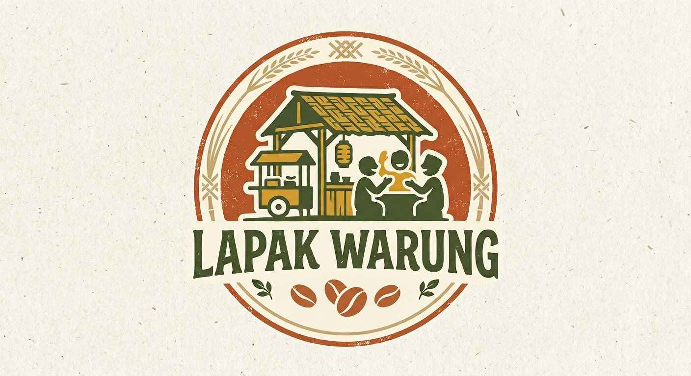
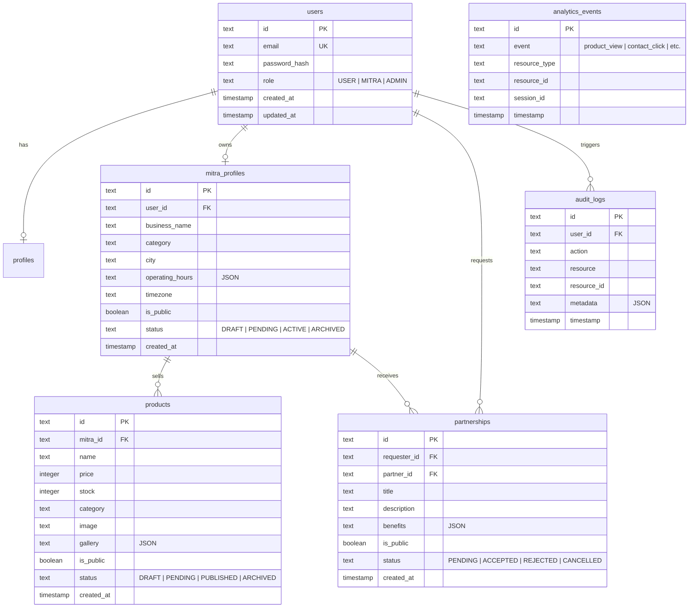

# 🏪 Local Warung UMKM (Lapak Warung)

Platform digital pemberdayaan Usaha Mikro, Kecil, dan Menengah (UMKM) lokal berbasis web modern, ringan, dan ramah akses luring (Offline-First PWA). Sistem ini menghubungkan pelaku usaha warung lokal dengan konsumen dan mitra bisnis strategis melalui katalog produk interaktif, showcase kemitraan B2B/B2C, jam operasional dinamis, moderasi konten berjenjang, serta pelacakan analitik konversi secara real-time.



---

## 📑 Daftar Isi

- [Ikhtisar Proyek](#-ikhtisar-proyek)
- [Fitur Utama](#-fitur-utama)
- [Arsitektur & Tech Stack](#-arsitektur--tech-stack)
- [Metode & Algoritma Utama](#-metode--algoritma-utama)
- [Struktur Direktori](#-struktur-direktori)
- [Model Basis Data](#-model-basis-data)
- [Daftar Endpoint API](#-daftar-endpoint-api)
- [Panduan Instalasi & Menjalankan Aplikasi](#-panduan-instalasi--menjalankan-aplikasi)
- [Pengujian & Verifikasi Mutu](#-pengujian--verifikasi-mutu)
- [Dokumentasi Lanjutan](#-dokumentasi-lanjutan)

---

## 💡 Ikhtisar Proyek

**Local Warung UMKM** dibangun untuk menyelesaikan kendala digitalisasi warung tradisional dan UMKM daerah:
1. **Visibilitas Pasar**: Memudahkan konsumen mencari produk terdekat berdasarkan kategori, harga, dan ketersediaan stok aktual.
2. **Kemitraan Antar-UMKM**: Memfasilitasi kolaborasi bisnis, suplai barang, dan kemitraan antar pedagang lokal.
3. **Konektivitas Rendah (Low-Bandwidth Friendly)**: Mengadopsi prinsip Progressive Web App (PWA) dengan Service Worker agar katalog tetap dapat diakses saat jaringan internet tidak stabil.
4. **Keamanan & Kurasi Konten**: Sistem kurasi berbasis Role-Based Access Control (RBAC) di mana produk dan profil mitra baru melewati verifikasi oleh Administrator.

---

## 🚀 Fitur Utama

### 1. Eksplorasi Publik & Konsumen (Guest)
- **Katalog Produk Dinamis**: Pencarian teks penuh (*full-text query*), filter multi-kategori, rentang harga (*min-max*), status stok (*Tersedia/Habis*), dan pengurutan (*terbaru, termurah, termahal*).
- **Storefront Mitra Warung**: Halaman profil warung lengkap dengan informasi kontak langsung (WhatsApp/Telepon), alamat, peta, dan badge status operasional (*BUKA/TUTUP*) secara otomatis.
- **Data Privacy & Sanitization DTO**: Masking jumlah stok persis ke publik (hanya mengekspos status ketersediaan) untuk mencegah *inventory scraping* kompetitor.
- **Katalog Kemitraan**: Informasi kolaborasi dan penawaran kemitraan terbuka antar pengusaha lokal.

### 2. Panel Manajemen Mitra (UMKM)
- **Registrasi & Verifikasi Profil**: Formulir pendaftaran usaha, logo, banner, dan deskripsi toko.
- **Konfigurasi Jam Operasional**: Jadwal buka/tutup granular untuk setiap hari (Senin s.d. Minggu) dengan sinkronisasi zona waktu (WIB/WITA/WIT).
- **Manajemen Inventaris Produk**: Tambah, ubah, dan arsip produk dengan dukungan unggah multi-gambar (galeri) yang tervalidasi.
- **Manajemen Kemitraan**: Mengajukan tawaran kemitraan ke mitra lain serta mengelola status tawaran masuk (*Accept*, *Reject*, *Cancel*).

### 3. Panel Moderasi & Analitik Administrator
- **Antrean Moderasi Konten (*Moderation Desk*)**: Peninjauan produk, profil mitra, dan kemitraan berstatus `PENDING` dengan aksi persetujuan (`APPROVE`) atau penolakan (`REJECT` disertai alasan tertulis).
- **Audit Trail Logging**: Pencatatan riwayat audit tak terhapus (*immutable log*) untuk setiap aksi mutasi sistem penting.
- **Dashboard Analitik & Rasio Konversi (CTR)**: Agregasi real-time metrik `product_view`, `mitra_view`, `partnership_view`, `search`, `contact_click`, dan `cta_click` beserta kalkulasi otomatis Click-Through Rate (CTR).

### 4. Resiliensi Jaringan & PWA
- **Service Worker Offline Cache**: Caching aset statis (*Cache-First*) dan caching respons navigasi (*Network-First with Fallback*).
- **HTTP Client Auto-Retry**: Mekanisme retry otomatis dengan backoff linear untuk kegagalan transmisi data idempoten.
- **Indikator Reaktivitas Jaringan**: Banner informatif otomatis saat koneksi terputus dan pemulihan koneksi secara instan.

---

## 🛠️ Arsitektur & Tech Stack

Platform ini dirancang dengan pendekatan arsitektur terpisah (*Decoupled Client-Server Architecture*) yang mengedepankan performa eksekusi tinggi dan ukuran bundle minimal.

```
┌─────────────────────────────────────────────────────────────┐
│                      Frontend Client                        │
│   Svelte 5 + TypeScript + Vite + Svelte-Routing + PWA (SW)  │
└──────────────────────────────┬──────────────────────────────┘
                               │ HTTP / JSON API (CORS + JWT)
┌──────────────────────────────▼──────────────────────────────┐
│                    Backend REST Engine                      │
│        Bun Runtime + ElysiaJS Web Framework (TypeBox)       │
├─────────────────────────────────────────────────────────────┤
│  Services:                                                  │
│  - LocalStorageProvider (Magic-Bytes Sniffing & Path Guard) │
│  - Analytics Engine (CTR Aggregation)                       │
│  - Store Schedule Engine (Intl DateTime Evaluator)          │
├─────────────────────────────────────────────────────────────┤
│  ORM & Data Layer:                                          │
│  - Drizzle ORM (Type-safe SQL queries)                      │
│  - SQLite Database Engine                                   │
└─────────────────────────────────────────────────────────────┘
```

| Lapisan (Layer) | Teknologi | Versi | Justifikasi Pemilihan |
|---|---|---|---|
| **Runtime Backend** | [Bun](https://bun.sh/) | Latest | Startup instan, performa I/O tinggi, native TypeScript execution, dan built-in SQLite engine. |
| **Backend Framework** | [ElysiaJS](https://elysiajs.com/) | 1.4+ | Framework performa tinggi berbasis Bun, type-safety end-to-end dengan skema TypeBox, dan plugin modular. |
| **ORM / Data Access** | [Drizzle ORM](https://orm.drizzle.team/) | 0.45+ | Query builder tanpa overhead beban runtime besar, migrasi skema deklaratif, dan inferensi tipe TypeScript otomatis. |
| **Basis Data** | SQLite | 3.x | Ringan, *zero-configuration*, terisolasi dalam berkas lokal (`sqlite.db`), ideal untuk deployment UMKM mandiri. |
| **Autentikasi & Keamanan** | JWT + Bun Password Hashing | - | Stateless session via `@elysiajs/jwt` dengan HttpOnly Cookie/Bearer Token dan hashing password Argon2/Bcrypt bawaan Bun. |
| **Frontend Framework** | [Svelte 5](https://svelte.dev/) | 5.57+ | Kompilasi ke native JavaScript tanpa virtual DOM (low memory footprint), reaktivitas berbasis *runes*, dan sintaks ekspresif. |
| **Build Tool & Bundler** | [Vite](https://vitejs.dev/) | 8.3+ | Lightning-fast Hot Module Replacement (HMR) dan optimalisasi bundle modern ES module. |
| **Routing Frontend** | `svelte-routing` | 2.13+ | Client-side declarative routing berbasis History API yang kompatibel dengan SPA/PWA. |
| **PWA & Offline Layer** | Service Worker API | Native | Strategi Cache-First dan Network-First untuk menjamin ketersediaan UI saat luring. |

---

## 🧠 Metode & Algoritma Utama

Berikut ringkasan metode dan algoritma yang diimplementasikan dalam sistem (detail lengkap tersedia di [ALGORITMA_DAN_IMPLEMENTASI.md](file:///c:/Users/user/Desktop/local-warung-umkm/ALGORITMA_DAN_IMPLEMENTASI.md)):

1. **Algoritma Deteksi Tanda Tangan Berkas (*Magic Bytes Sniffing*)**:
   - Membaca 12 byte pertama dari header berkas yang diunggah untuk memverifikasi format berkas yang sebenarnya (JPEG: `FF D8 FF`, PNG: `89 50 4E 47 0D 0A 1A 0A`, WEBP: `RIFF....WEBP`). Mencegah eksekusi berkas berbahaya yang menyamar sebagai gambar.
2. **Algoritma Evaluasi Status Buka Toko (*Storefront Schedule Evaluator*)**:
   - Memetakan hari lokal dan waktu saat ini menggunakan `Intl.DateTimeFormat` sesuai zona waktu toko (`Asia/Jakarta`), membandingkan string waktu 24 jam (`HH:mm`) terhadap rentang `[openTime, closeTime]` untuk menghasilkan status operasional akurat.
3. **Pencegahan Masalah N+1 (*Batch Hash-Map Relational Resolution*)**:
   - Mengumpulkan seluruh `mitraId` unik dari daftar produk menggunakan struktur data `Set`, mengeksekusi satu kali kueri agregat `WHERE id IN (...)`, lalu memetakannya ke `Map<string, Mitra>` untuk pengisian relasi dalam kompleksitas waktu $O(1)$.
4. **Algoritma Agregasi Analitik & Metrik Rasio Konversi (*CTR Calculation*)**:
   - Menghitung efektivitas konversi pengunjung menjadi prospek interaksi (*Click-to-Contact* dan *Call-to-Action*) menggunakan formula rasio persentase terhadap total impresi tampilan produk/mitra.
5. **Algoritma Retry Idempoten dengan Linear Backoff**:
   - Penanganan otomatis kegagalan jaringan pada HTTP GET client dengan jeda progresif $T = \text{attempt} \times 400\text{ ms}$ sebelum melempar galat ke antarmuka pengguna.
6. **State Machine Moderasi Berjenjang**:
   - Mengatur siklus hidup konten melalui status transisi valid: `PENDING` $\rightarrow$ `PUBLISHED` / `REJECTED` / `UNPUBLISHED` / `ARCHIVED`, dengan penegakan integritas data (penolakan wajib melampirkan keterangan revisi).

---

## 📁 Struktur Direktori

```
local-warung-umkm/
├── README.md                      # Dokumentasi Utama Proyek
├── ALGORITMA_DAN_IMPLEMENTASI.md  # Bedah Algoritma, Alur Matematis & Implementasi
├── TECH_STACK.md                  # Rationale & Perbandingan Arsitektur Teknologi
├── lapak_warung_logo.jpeg         # Logo Identitas Platform
│
├── backend/                       # Server REST API (Bun + Elysia)
│   ├── package.json               # Dependensi & Skrip Backend
│   ├── tsconfig.json              # Konfigurasi TypeScript Server
│   ├── drizzle.config.ts          # Konfigurasi Drizzle ORM
│   ├── sqlite.db                  # Basis Data SQLite Lokal
│   ├── uploads/                   # Direktori Berkas Gambar Terunggah
│   └── src/
│       ├── index.ts               # Entry point server, CORS, Static routes, Global error handler
│       ├── test_sprint2b.ts       # Suite Pengujian Integrasi Otomatis (24+ skenario)
│       ├── db/
│       │   ├── index.ts           # Inisialisasi Database Driver (bun:sqlite + Drizzle)
│       │   ├── schema.ts          # Definisi Relasi Entitas & Indeks Tabel
│       │   └── migrate.ts         # Script Migrasi & Seed Basis Data
│       ├── middleware/
│       │   └── auth.ts            # Middleware JWT Validation & Role Extraction
│       ├── services/
│       │   └── storage.ts         # LocalStorageProvider (Magic Bytes & Sanitasi Jalur)
│       └── routes/
│           ├── admin.ts           # Moderasi Antrean, Log Audit, Analitik Dashboard
│           ├── analytics.ts       # Logging Event Publik & Rekapitulasi Konversi
│           ├── auth.ts            # Registrasi, Login, Me, Logout
│           ├── mitra.ts           # Profil Usaha, Verifikasi, & Update Mitra
│           ├── partnerships.ts    # Pembuatan & Manajemen Status Kemitraan
│           ├── products.ts        # CRUD Produk Mitra
│           ├── profile.ts         # Manajemen Profil Konsumen
│           ├── public.ts          # Katalog Pencarian, Filter Produk & Storefront Terbuka
│           ├── upload.ts          # Endpoint Unggah Berkas Gambar
│           └── users.ts           # Manajemen Data Pengguna
│
└── frontend/                      # Client Application (Svelte 5 + Vite)
    ├── package.json               # Dependensi & Skrip Frontend
    ├── vite.config.ts             # Konfigurasi Bundler Vite
    ├── svelte.config.js           # Konfigurasi Kompiler Svelte
    ├── tsconfig.json              # Konfigurasi TypeScript Client
    ├── index.html                 # Template Dasar HTML & Entry Point PWA
    ├── public/
    │   ├── favicon.svg            # Favicon Vektor
    │   ├── icons.svg              # Ikon Sprite SVG
    │   ├── manifest.json          # Web App Manifest PWA
    │   └── sw.js                  # Service Worker (Cache-First & Network-First)
    └── src/
        ├── main.ts                # Bootstrap Instance Svelte
        ├── App.svelte             # Router Utama & Listener Status Online/Offline
        ├── app.css                # Desain Tema Global & Variabel Warna
        ├── lib/
        │   ├── api.ts             # HTTP Client Helper (Auto-retry & Network Error Catcher)
        │   └── components/
        │       ├── Navbar.svelte  # Bar Navigasi Responsif
        │       ├── Input.svelte   # Komponen Input Form Reusable
        │       └── Button.svelte  # Komponen Tombol Desain Sistem
        └── routes/
            ├── Home.svelte        # Beranda Pencarian & Rekomendasi Unggulan
            ├── Products.svelte    # Halaman Katalog & Pencarian Multi-Filter
            ├── ProductDetail.svelte# Detail Spesifikasi Produk & Kontak Penjual
            ├── MitraPublic.svelte # Halaman Profil Warung & Jadwal Buka
            ├── PartnershipPublic.svelte # Halaman Jelajah Kemitraan Publik
            ├── PartnershipDetail.svelte # Detail Penawaran Kerjasama UMKM
            ├── MitraDashboard.svelte    # Panel Kelola Produk & Profil Warung
            ├── PartnershipDashboard.svelte # Panel Manajemen Ajakan Kerjasama
            ├── Admin.svelte       # Panel Kontrol Moderasi & Analitik Admin
            ├── Login.svelte       # Antarmuka Masuk & Pendaftaran Akun
            └── Profile.svelte     # Pengaturan Profil Akun Pengguna
```

---

## 🗄️ Model Basis Data

Tabel-tabel dalam basis data dirancang dengan normalisasi terstruktur dan indeks pencarian pada kolom kunci:



---

## 🌐 Daftar Endpoint API

Semua endpoint backend disajikan melalui prefix `/api`:

### Autentikasi (`/api/auth`)
| Metode | Rute | Akses | Deskripsi |
|---|---|---|---|
| `POST` | `/register` | Publik | Mendaftarkan akun baru (default role: `USER`). |
| `POST` | `/login` | Publik | Verifikasi kredensial dan menerbitkan JWT token. |
| `POST` | `/logout` | Login | Menghapus session cookie autentikasi. |
| `GET` | `/me` | Login | Mendapatkan informasi pengguna dan profil aktif. |

### Penemuan Publik (`/api/public`)
| Metode | Rute | Akses | Deskripsi |
|---|---|---|---|
| `GET` | `/products` | Publik | Menjelajahi katalog produk dengan pencarian, filter, dan pagination. |
| `GET` | `/products/:id` | Publik | Detail lengkap produk, produk terkait, dan status operasional toko. |
| `GET` | `/mitra` | Publik | Direktori mitra UMKM aktif. |
| `GET` | `/mitra/:id` | Publik | Profil storefront warung, jam operasional, dan daftar produknya. |
| `GET` | `/partnerships` | Publik | Direktori program kemitraan UMKM terbuka. |
| `GET` | `/partnerships/:id` | Publik | Detail penawaran kemitraan dan profil mitra pengaju. |

### Analitik & Interaksi (`/api/analytics`)
| Metode | Rute | Akses | Deskripsi |
|---|---|---|---|
| `POST` | `/event` | Publik | Mencatat impresi atau klik secara asinkron (*non-blocking*). |
| `GET` | `/summary` | Admin | Menampilkan kalkulasi rasio konversi (CTR) dan log event terkini. |

### Moderasi & Administrasi (`/api/admin`)
| Metode | Rute | Akses | Deskripsi |
|---|---|---|---|
| `GET` | `/pending` | Admin | Memperoleh daftar produk, mitra, dan kemitraan dalam status review. |
| `POST` | `/moderate/:entityType/:id` | Admin | Menyetujui atau menolak konten (`APPROVE`, `REJECT`, `UNPUBLISH`). |
| `GET` | `/audit-logs` | Admin | Menginspeksi rekaman jejak audit sistem. |
| `GET` | `/analytics/summary` | Admin | Metrik analitik traffic dan konversi interaksi. |

### Manajemen Mitra & Inventaris (`/api/mitra`, `/api/products`, `/api/partnerships`, `/api/upload`)
| Metode | Rute | Akses | Deskripsi |
|---|---|---|---|
| `POST` | `/mitra` | User/Mitra | Mendaftarkan profil usaha UMKM baru. |
| `PUT` | `/mitra/:id` | Pemilik/Admin| Memperbarui data profil usaha dan jam buka/tutup. |
| `POST` | `/products` | Mitra/Admin | Mendaftarkan produk dagangan baru (status awal: `PENDING`). |
| `PUT` | `/products/:id` | Pemilik/Admin| Memperbarui rincian produk, harga, stok, atau visibilitas. |
| `POST` | `/partnerships` | User/Mitra | Mengirimkan proposal ajakan kemitraan ke mitra tujuan. |
| `POST` | `/partnerships/:id/accept` | Mitra Target | Menyetujui tawaran kemitraan masuk. |
| `POST` | `/partnerships/:id/reject` | Mitra Target | Menolak tawaran kemitraan masuk. |
| `POST` | `/upload` | Login | Mengunggah gambar (JPEG/PNG/WEBP) dengan verifikasi magic-bytes. |

---

## 💻 Panduan Instalasi & Menjalankan Aplikasi

### Prasyarat Sistem
- [Bun Runtime](https://bun.sh/) (v1.0.0 atau lebih baru)
- [Node.js](https://nodejs.org/) (v18+ untuk Vite tooling)
- Git

### 1. Kloning Repositori
```bash
git clone <url-repositori>
cd local-warung-umkm
```

### 2. Menjalankan Backend API
Buka terminal pertama:
```bash
cd backend

# Instalasi dependensi
bun install

# Menjalankan migrasi database SQLite
bun run src/db/migrate.ts

# Menjalankan server dalam mode development (auto-reload)
bun run dev
```
> Server backend akan berjalan secara default di `http://localhost:3000`.

### 3. Menjalankan Frontend Web
Buka terminal kedua:
```bash
cd frontend

# Instalasi dependensi
npm install

# Menjalankan dev server Vite
npm run dev
```
> Aplikasi web frontend dapat diakses melalui peramban di `http://localhost:5173`.

---

## 🧪 Pengujian & Verifikasi Mutu

Sistem dilengkapi dengan rangkaian pengujian integrasi otomatis menyeluruh di berkas [backend/src/test_sprint2b.ts](file:///c:/Users/user/Desktop/local-warung-umkm/backend/src/test_sprint2b.ts). Rangkaian pengujian memvalidasi:

1. **Guest Public Discovery**: Verifikasi respon 200, format pagination, relasi produk, dan sanitasi stok (tidak membocorkan angka persis inventaris).
2. **Kalkulasi Jam Operasional**: Validasi penentuan status toko (`BUKA` / `TUTUP`) berdasarkan zona waktu.
3. **Pencatatan Event Analitik**: Pengujian logging event tanpa hambatan autentikasi.
4. **Keamanan RBAC**: Memastikan role `USER` ditolak dengan kode status `403 Forbidden` saat mencoba mengakses endpoint moderasi admin atau membuat produk mitra.
5. **Integritas Aturan Bisnis**: Memastikan penolakan konten tanpa alasan (`reason`) ditolak dengan kode `400 Bad Request`.
6. **Siklus Hidup Moderasi Lengkap**: Skenario pembuatan produk oleh mitra $\rightarrow$ pengecekan produk belum muncul di pencarian publik $\rightarrow$ persetujuan oleh admin $\rightarrow$ verifikasi produk langsung tampil di publik.

Untuk menjalankan pengujian:
```bash
# Pastikan server backend sedang berjalan di http://localhost:3000
cd backend
bun run src/test_sprint2b.ts
```

Output uji integrasi:
```text
--- STARTING SPRINT 2B INTEGRATION TESTS ---
[PASS] GET /api/public/products returns 200
[PASS] Sanitized stock status (no raw internal stock exposed)
[PASS] Operating status calculated correctly (BUKA/TUTUP)
[PASS] Normal USER denied from /api/admin/pending (403)
[PASS] Normal USER denied from creating product (403)
[PASS] ADMIN can access /api/admin/pending
[PASS] Rejecting without moderation reason returns 400 BAD_REQUEST
[PASS] Pending product is NOT visible to public guest
[PASS] Admin successfully approves product
[PASS] Approved product IS immediately discoverable by public guest
================================
TOTAL PASSED: 24+
TOTAL FAILED: 0
================================
```

---

## 📚 Dokumentasi Lanjutan

Untuk rincian teknis yang lebih komprehensif, silakan pelajari dokumen pelengkap berikut:
- 📖 [ALGORITMA_DAN_IMPLEMENTASI.md](file:///c:/Users/user/Desktop/local-warung-umkm/ALGORITMA_DAN_IMPLEMENTASI.md) - Dokumentasi mendalam tentang rancangan algoritma, analisis kompleksitas ($O(1)$ vs $O(N)$), formula CTR, mekanisme magic-bytes, dan arsitektur Service Worker.
- 📐 [TECH_STACK.md](file:///c:/Users/user/Desktop/local-warung-umkm/TECH_STACK.md) - Bedah komparasi teknologi, pertimbangan performa, footprint memori, dan alasan arsitektural pemilihan Bun + Elysia + Svelte 5.

---

**Local Warung UMKM** © 2026. Didedikasikan untuk kemajuan ekonomi mikro dan digitalisasi warung Indonesia.
